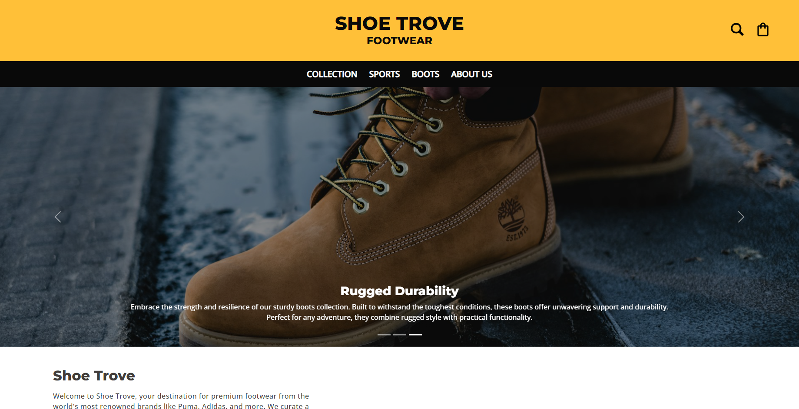

# ShoeTrove (Deployed to `Vercel`)
## Deployment Address: [`shopping-app-react-bice.vercel.app`](https://shopping-app-react-bice.vercel.app "shopping-app-react-bice.vercel.app")
### A fully responsive shoe shopping app built with React and react-router-dom as an SPA. This app allows users to browse products, add items to their cart, and manage their shopping experience seamlessly.

## Table of Contents
- [Features](#features)
- [Demo](#demo)
- [Installation](#installation)
- [Usage](#usage)
- [Technologies Used](#technologies-used)
- [Contributing](#contributing)
- [License](#license)
- [Contact](#contact)

## Features
- SPA with react-router implementation
- Utilizes react hooks to handle fetching data, error and loading states
- Product browsing and filtering
- Shopping cart management
- Order summary and checkout
- Custom styling
- Responsive design

## Demo
**Check out the live demo [here](https://shopping-app-react-bice.vercel.app).**




## Installation

1. Clone the repository
    ```bash
    git clone https://github.com/myinan/shopping-app-react.git
    ```

2. Navigate to the project directory
    ```bash
    cd shopping-app-react
    ```

3. Install dependencies
    ```bash
    npm install
    ```

4. Start the development server
    ```bash
    npm start
    ```

5. Open your browser and go to `http://localhost:3000`

## Usage
- **Home Page:** Browse through latest posts and new arrivals.
- **Product Pages:** View details of a specific product through Collection, Sports or Boots pages and add it to the cart.
- **Search:** Search all of the products available.
- **Cart:** Manage items in your cart and proceed to checkout.

## Technologies Used
- React
- react-router
- CSS Modules
- ESLint, Prettier
- Vercel

## Contributing
Contributions are welcome! Please feel free to submit a Pull Request.

## License
This project is licensed under the MIT License.

## Contact
Created by [Yasir İnan](https://github.com/myinan) - feel free to contact me!
